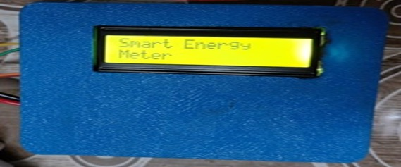

# 🔌 Smart Energy Meter using ESP32 📊

This project is a **WiFi-enabled Smart Energy Meter** built using an ESP32. It monitors **Voltage, Current, Power, Energy (kWh), and Cost (₹)** in real-time. The device displays the values on an LCD and hosts a web server for live data viewing and CSV export.

---

## 📷 Project Images

### 🔧 Hardware Setup

  

---

### 📟 LCD Display Screens

**Startup Screen:**

  

---

**Live Voltage & Current Display:**

  

---

### 🌐 Web Server Dashboard

**Example 1:**

  

---

**Example 2:**

  

---

## 📐 Project Design

### 🔳 3D Model of Enclosure

  

---

### 🧠 Block Diagram

  

---

### 🔌 Circuit Diagram

  

---

## 🛠️ Hardware Required

| Component                 | Quantity | Description                                 |
|---------------------------|----------|---------------------------------------------|
| ESP32 Dev Board           | 1        | Main MCU with WiFi support                  |
| ZMPT101B Module           | 1        | Voltage sensor                              |
| SCT-013 (Current Sensor)  | 1        | Current measurement (Non-invasive)          |
| LCD 16x2 with I2C         | 1        | Display values locally                      |
| 10k Resistor, jumper wires, breadboard | - | Miscellaneous connections                 |

---

## 🧰 Hardware Connections

| Component        | ESP32 Pin  | Notes                       |
|------------------|------------|-----------------------------|
| ZMPT101B         | GPIO 35    | Voltage sensor analog input |
| SCT-013          | GPIO 34    | Current sensor analog input |
| LCD SDA          | GPIO 21    | I2C communication           |
| LCD SCL          | GPIO 22    | I2C communication           |
| 5V Power Supply  | VIN / GND  | For sensors and LCD         |

💡 *Note: Use appropriate calibration resistors or burden resistors with the SCT-013 sensor.*

---

## 🔍 Features

✅ Real-time Monitoring  
✅ Dual-page LCD display (auto toggles every 3 sec)  
✅ Web interface (auto refresh every 2 seconds)  
✅ Downloadable CSV data  
✅ Cost calculation based on kWh (customizable rate)

---

## 📡 WiFi Access Point Setup

Connect to:

- **SSID:** `ESP32_Server`  
- **Password:** `12345678`  

Then open your browser and go to: `http://192.168.4.1`

---

## 📺 LCD Handling

The 16x2 LCD automatically switches between two pages every 3 seconds:

**Page 1:**  
- **V**: 230.5V **I**: 0.23A
- **P**: 52.8W

**Page 2:**  
- **Energy**: 0.150kWh
-**Cost**: 0.98 INR

----

## 🌐 Web Server Endpoints

ESP32 runs a mini web server with two main routes:

- `/` → Real-time dashboard  
- `/data.csv` → CSV export for logging  

✅ Live dashboard shows voltage, current, power, energy, and cost.  
✅ Download button lets users save a `.csv` report.

---

## 🧾 CSV Logging

The ESP32 logs all readings in memory. Each cycle appends new values.

📤 *CSV export makes this system suitable for billing, energy tracking, or energy audit use cases.*

